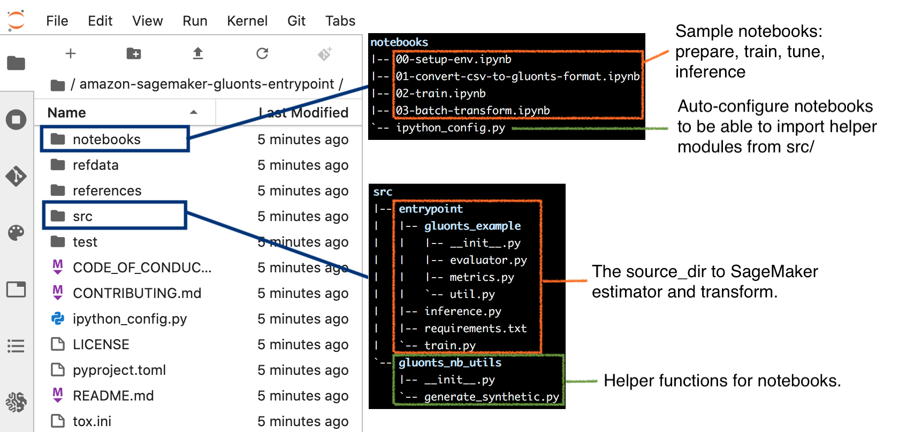

## Example Entrypoint Scripts to run GluonTS on Amazon SageMaker

This repository contains the example that supplement the
[blog post](https://aws.amazon.com/blogs/industries/novartis-ag-uses-amazon-sagemaker-and-gluonts-for-demand-forecasting/)
on using [GluonTS](https://ts.gluon.ai/) to develop custom product demand forecasting on
[Amazon SageMaker](https://aws.amazon.com/sagemaker/), and generate demand forecasts for each products with custom models.

The sample notebooks demonstrate faster experimentation with multiple custom models. The changes involves only parameteric changes to the entrypoint train script.

## Implementation notes

The entrypoint train script utilizes GluonTS to work with time series data in
a simpler fashion, and to access many state-of-the-art custom models in the
GluonTS library. The novelties demonstrated by the script include:

- a single generic train script that supports multiple built-in algorithms in
  GluonTS.

- Guide modular style implementation in notebooks and entrypoint scripts.

- The train script passes through hyperparameters, it receives as command line
  arguments, directly to the specified GluonTS estimator.

  * The entrypoint train script does not need to explicitly declare all those
    hyperpameters in its body.

  * This functionality utilizes another sample repository:
    [aws-samples/amazon-sagemaker-entrypoint-utilities](https://github.com/aws-samples/amazon-sagemaker-entrypoint-utilities),
    a dependency that the entrypoint train script declares in its
    `requirements.txt`

- At the end of training, the train script performs backtesting on a test
  split. Then, the script outputs to files the backtest performance metrics,
  the forecasts resulted from test split, and backtest plots of all timeseries
  as montages and individual plots.

  * This is done by design, and the aim is to let data scientists quickly
    analyze their model performance without having to separately run inferences
    (and additional downstream tasks for plotting etc.).

  * This functionality utilizes another sample repository:
    [aws-samples/smallmatter-package](https://github.com/aws-samples/smallmatter-package),
    a dependency that the entrypoint train script declares in its
    `requirements.txt`

## Security

See [CONTRIBUTING](CONTRIBUTING.md#security-issue-notifications) for more information.

## License

This library is licensed under the MIT-0 License. See the LICENSE file.

## Authors
* Verdi March [GitHub](https://github.com/verdimrc)
* Beibit Baktygaliyev
* Zmnako Awrahman [GitHub](https://github.com/zmnaka)
